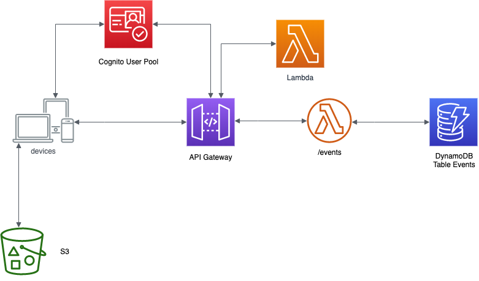

# Openathon VI - Serverless with AWS

¡¡Bienvenido al Openathon VI!!

En esta edición vamos a descubrir las características y funcionamiento de algunos de los servicios web de Amazon y particularmente aquellos que nos permiten desplegar y ejecutar aplicaciones en la nube sin necesidad de reservar o administrar ningún tipo de servidor. Este enfoque se encuadra en las soluciones conocidas como Serverless, que cada día son más populares y que se están convirtiendo en un alternativa muy atractiva a los enfoques tradicionales de arquitecturas basadas en servidores, ya sean estos físicos o virtuales, donde es necesario disponer de servidores, ya sea físicos o virtuales, que es necesario adquirir y administrar.

Los Amazon Web Services, o de manera abreviada AWS, son una serie de servicios implementados y ofrecidos por Amazon en marco de la cloud computing. AWS Lambda es uno de estos servicios y permite disponer de funciones para atender a diversos tipos de eventos sin tener que provisionar o adminitrar ningún tipo de servidor. El coste de estos servicios depende únicamente del tiempo de proceso que se consuma en su ejecución. En este Openathon, vamos a utilizar este servicio para dotar a nuestra aplicación de eventos de la lógica necesaria para su ejecución.

Al final de es Openathon, tendrás la siguiente arquitectura serveless completamente funcional:

    

Los servicios que utilizaremos serán:

1. DynamoDB. Servicio de base de datos no sql.
2. IAM. (Identity and Access Management) Servicio para el control del acceso al resto de servicios.
3. S3. Servicio de almacenamiento para publicar la aplicación Angular.
4. Cognito. Servicio de autenticación de usuarios.
5. Lambda Functions. Funciones de negocio.
6. API Gateway. Gestiona las API Rest que darán acceso controlado a las funciones Lambda.

El indice del contenido es el siguiente:

1. [Introduccion Serverless AWS & Visión General de la Aplicación.](/introduction)
2. [LAB 0. Pasos iniciales](/lab-00)
3. [LAB 1. DynamoDB](/lab-01)
4. [LAB 2. Crear rol en IAM (Sólo con cuenta privada)](/lab-02)
5. [LAB 3. Crear función lambda: listEvents](/lab-03)
6. [LAB 4. Crear API Gateway](/lab-04)
7. [LAB 5. Cognito](/lab-05)
8. [LAB 6. Terminar el API Gateway con lambda](/lab-06)
9. [LAB 7. Publicar la web en S3](/lab-07)
