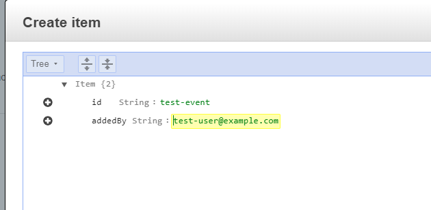

# Laboratorio 1. DynamoDB

En esta sección crearemos una tabla en DynamoDB llamada eventos. Esta tabla será usada para almacenar los eventos registrados por los usuarios. Para crearla seguiremos los siguientes pasos:

1. En la consola de AWS, en el menú Services buscaremos y seleccionaremos “DynamoDB”.

> <mark>IMPORTANTE</mark>. Hay que verificar que te encuentras en la región correcta. Cada uno de los servicios que se creen en los laboratorios (Cognito, API Gateway, Lambda y DynamoDB) deben pertenecer a la misma región. Para tener más información acerca de las regiones puedes acceder a este enlace.
1. Seleccionamos “Create table”.
2. Introducimos:
   * Nombre: “events”.
   * Primary Key. Estableceremos los campos que la forman, en nuestro caso dos:
     * Partition key: “title” (string).
     * Seleccionamos “Add sort key” y añadimos “date” (string).
4. Pulsamos Create, llevará en torno a 15 segundos la creación de la tabla. Una vez creada podremos acceder a todos sus detalles en la sección “tables” del servicio “DynamoDB”.
5. En el panel de control de la tabla pulsamos la pestaña “ítems” y a continuación “create ítem” para crear nuestro primer evento.
6. En el dialogo introduciremos los datos de nuestro primer evento:
   * Title: test evento
   * Date: 2020-05-07

7. A continuación, introduciremos el resto de los datos. Pulsando el “+” adyacente a “date” seleccionaremos “Append” y “String” indicando que queremos introducir en el ítem un dato de tipo cadena. Los ítems en las tablas de DynamoDB no tienen que cumplir una estructura obligatoria más allá de los que forman la primary key. De esta manera incorporaremos:
   * Key: location – Value: Málaga.
   * Key: description – Value: Lorem Ipsum is simply dummy text of the printing and type setting industry. Lorem Ipsum has been the industry's standard dummy.
   * Key: addedBy– Value: test-user.
8. Pulsamos guardar. Hemos creado así el primer evento.
