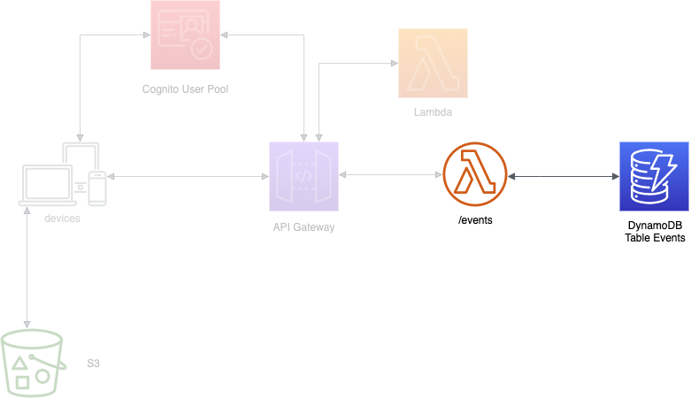

    

# Laboratorio 3. Crear función lambda: listEvents

## Introducción

    

[AWS Lambda](https://docs.aws.amazon.com/es_es/lambda/?id=docs_gateway) es un servicio de AWS que ejecuta código en respuesta a eventos sin la necesidad de aprovisionar, configurar y administrar un servidor específico que lo contenga y ejecute. Entre otras ventajas esto supone que no existe coste por la capacidad aprovisionada, sino únicamente por el tiempo de computación efectivamente consumido en la ejecución de la función. AWS se encarga de toda la gestión de la ejecución de la función, incluida la escalabilidad necesaria para garantizar un servicio de alta disponibilidad. Una función lambda puede ser activada tanto desde una aplicación web o móvil o por cualquiera del resto de servicios de AWS que requieran de su ejecución.

Las funciones lambda están limitadas en las tareas y servicios que pueden ejecutar a través de un rol IAM asignado. En estos laboratorios puedes disponer de tu propio rol, en el caso que lo estes realizando desde tu propia cuenta AWS o de un rol precreado, si lo estas realizando con la cuenta de formación asignada.

Las funciones lambda pueden implementarse en múltiples lenguajes de programación. En nuestro openathon cubriremos dos (java y python) para facilitar la comprensión a los participantes. Por tanto dirígete a la versión que te resulte más familiar.

## Prerequisito - Implementación en Java

Si la función lambda la desarrollamos en Java, es necesario disponer de un contenedor que permita subir a AWS las clases que van a implementarla. Este contedor se materializa en un bucket que creamos utilizando el servicio ["Amazon Simple Storage Service"](https://docs.aws.amazon.com/s3/index.html) (S3). Para hacerlo hay que seguir los siguientes pasos:

1.	En la consola de AWS, en el menú Services buscaremos y seleccionaremos “S3”.

> Hay que verificar que te encuentras en la región correcta. Cada uno de los servicios que se creen en los laboratorios (Cognito, API Gateway, Lambda y DynamoDB) deben pertenecer a la misma región.

2.	Creamos el “code bucket” que contendrá las funciones lamdba que despleguemos en AWS. Pulsamos “Create Bucket”, como nombre y en minúsculas estableceremos “events-web-xxxxxxx”. El nombre del bucket tiene que ser único en todo AWS, así que deberemos sustituir “events-web-xxxxxxx” por un identificador exclusivo, por ejemplo “events-web-john-smith1234”.
3.	Pulsamos “create".

## Nuestra primera función. Events-List

En esta sección crearemos y probaremos nuestra primera función lambda, “Events-List”, que nos permitirá acceder a los datos existentes en la tabla “events” que hemos creado en DynamoDB.

En los laboratorios vamos a trabajar con dos opciones: Python y Java. Según prefieras puedes utilizar una u otra. Continua el laboratorio en el punto correspondiente (puedes realizar las dos versiones si te interesa conocer como se implementa en una y otra, decidiendo luego en el Gateway a que versión quieres dirigirte).

En este punto seleccionamos como crear muestra función, ya que será distinto según el lenguaje de programación que vayamos a usar:

[ Crear función EventList en Python >](../lambda-functions-python/EventsList)  

[ Crear función EvenList en Java >](../lambda-functions-java/EventsList)  

	
## Probando la función

Una vez creada la función, sea cual sea el lenguaje utilizado, de manera inmediata podemos probar su funcionamiento. Para hacerlo:

1.	Debemos crear el evento de prueba:
      * Pulsamos “Test” en la parte superior de la ventana.
      * En “Event template” dejamos seleccionado “hello world”.
      * En “Event name” introducimos “ListTest”.
      * Como los datos de entrada no son relevantes para la función podemos dejar los que vienen por defecto.
      * Pulsamos “Create".
2. Una vez creado el evento, podemos pulsar “Test” y comprobar el resultado del funcionamiento de la función:

    

 
8. Desplegando “Details”, podremos revisar los logs y la salida de la función, en este caso el evento que creamos previamente como primer ítem de la tabla “Events”.
    

    

9. Adicionalmente, si pulsamos la pestaña "Monitoring" en la parte inferior podremos acceder a toda la información que se ha volcado en el servicio CloudWatch, incluyendo en el CloudWatch Logs Insights donde podremos acceder a los logs de las últimas ejecuciones.

## Actividad adicional

La función puede ejecutarse correctamente ya que dispone de las autorizaciones necesarias para hacerlo, pero ¿qué pasaría si no dispusiese de una de ellas?, ¿sería fácil comprobar el tipo de error en los logs?. Os proponemos crea un rol adicional "eventsFool" que no tuviese asignada la política necesaria para acceder a DynamoDB (si estas utilizando la cuenta de formación, ya estará creado) y comprobar que sucede si modificas la función creada para asignarselo y vuelves a lanzar el Test. 

## Conclusión

En este laboratorio hemos creado y probado nuestra primera función lambda. Comprobamos como de una manera sencilla podemos incorporar nuestras funciones de negocio a AWS, que pueden interactuar con otros servicios o recursos que hayamos creado. En el próximo laboratorio experimentaremos como configurar el servicio para que sea accesible desde internet, utilizando API Gateway.

[< Lab 02 ](../lab-02)  | [Lab 04 >](../lab-04)

    

