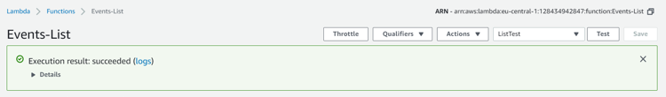
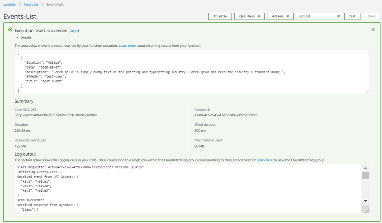
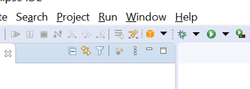
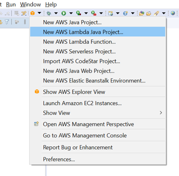

# Laboratorio 3. Crear función lambda: listEvents

## Introducción

[AWS Lambda](https://docs.aws.amazon.com/es_es/lambda/?id=docs_gateway) es un servicio de AWS que ejecuta código en respuesta a eventos sin la necesidad de aprovisionar, configurar y administrar un servidor específico que lo contenga y ejecute. Entre otras ventajas esto supone que no existe coste por la capacidad provisionada, sino únicamente por el tiempo de computación efectivamente consumido en la ejecución de la función. AWS se encarga de toda la gestión de la ejecución de la función, incluida la escalabilidad necesaria para garantizar un servicio de alta disponibilidad. Una función lambda puede ser activada tanto desde una aplicación web o móvil o por cualquiera del resto de servicios de AWS que requieran de su ejecución.

Las funciones lambda están limitadas en las tareas y servicios que pueden ejecutar a través de un rol IAM asignado. En estos laboratorios puedes disponer de tu propio rol, en el caso que lo estes realizando desde tu propia cuenta AWS o de un rol precreado, si lo estas realizando con la cuenta de formación asignada.

Las funciones lambda pueden implementarse en múltiples lenguajes de programación. En nuestro openathon cubriremos dos (java y python) para facilitar la comprensión a los participantes. Por tanto diríjete a la versión que te resulte más familiar.

## Prerequisito - Implementación en Java

Si la función lambda la desarrollamos en Java, es necesario disponer de un contenedor que permita subir a AWS las clases que van a implementarla. Este contedor se materializa en un bucket que creamos utilizando el servicio ["Amazon Simple Storage Service"](https://docs.aws.amazon.com/s3/index.html) (S3). Para hacerlo hay que seguir los siguientes pasos:

1.	En la consola de AWS, en el menú Services buscaremos y seleccionaremos “S3”.

> Hay que verificar que te encuentras en la región correcta. Cada uno de los servicios que se creen en los laboratorios (Cognito, API Gateway, Lambda y DynamoDB) deben pertenecer a la misma región.

2.	Creamos el “code bucket” que contendrá las funciones lamdba que despleguemos en AWS. Pulsamos “Create Bucket”, como nombre y en minúsculas estableceremos “events-web-xxxxxxx”. El nombre del bucket tiene que ser único en todo AWS, así que deberemos sustituir “events-code-xxxxxxx” por un identificador exclusivo, por ejemplo “events-code-john-smith1234”.
3.	Pulsamos “create".

## Nuestra primera función. Events-List

En esta sección crearemos y probaremos nuestra primera función lambda, “Events-List”, que nos permitirá acceder a los datos existentes en la tabla “events” que hemos creado en DynamoDB.
1.	En la consola de AWS, en el menú Services buscaremos y seleccionaremos “Lambda”.
> Hay que verificar que te encuentras en la región correcta. Cada uno de los servicios que se creen en los laboratorios (Cognito, API Gateway, Lambda y DynamoDB) deben pertenecer a la misma región.
2.	Pulsamos “Create Function”.
En este punto podemos seleccionar como crear muestra función, será distinto según el lenguaje de programación que vayamos a usar. En los laboratorios vamos a trabajar con dos opciones: Python y Java. Según prefieras puedes utilizar una u otra.

### Python version

1. Dejamos seleccionado “Author from Scatch” (crear desde cero) y en la sección Basic Information introducimos:
      * Function Name: Events-List.
      * Runtime: Python 3.8.
      * Pulsamos en “Choose or create an execution role” para expandirlo y marcamos “Use an existing role”, seleccionando el rol que hemos creado previamente “EventsRole” que permite a la función el acceso a la tabla events y al servicio de logs.
2. Pulsamos “Create Function”.
3. Con la función creada, en la ventana de detalle de la función nos desplazamos a la parte inferior de la ventana donde se puede editar su código. Allí reemplazamos el contenido por:

    ```python
    # Events-List
    # Esta función lambda se integra con el siguiente API method:
    # /events GET (list operation)
    # Su proposito es obtener los eventos existentes en la table Events

    from __future__ import print_function
    import boto3
    import json
    from boto3.dynamodb.conditions import Key
    from botocore.exceptions import ClientError

    def lambda_handler(event, context):

        print('Initiating Events-List...')
        print("Received event from API Gateway: " + json.dumps(event, indent=2))
        
        # Creamos el acceso a la tabla DynamoDB por el nombre
        dynamodb = boto3.resource('dynamodb')
        table = dynamodb.Table('events')

        # Obtenemos todos los eventos existentes en la tabla
        try:
            response = table.scan()
        except ClientError as e:
            print(e.response['Error']['Message'])
        else:
            print("scan succeeded:")

            # De la respuesta obtenida de DynamoDB devolvemos los items
            return response["Items"]
    ```

4.	Pulsamos “Save”.
5.	A continuación, vamos a probar el funcionamiento de la función, para hacerlo debemos crear el evento de prueba:
      * Pulsamos “Test” en la parte superior de la ventana.
      * En “Event template” dejamos seleccionado “hello world”.
      * En “Event name” introducimos “ListTest”.
      * Como los datos de entrada no son relevantes para la función podemos dejar los que vienen por defecto.
      * Pulsamos “Create".
6. Una vez creado el evento, podemos pulsar “Test” y comprobar el resultado del funcionamiento de la función:

<p align="center">
    
</p>
 
7. Desplegando “Details”, podremos revisar los logs y la salida de la función, en este caso el evento que creamos previamente como primer ítem de la tabla “Events”.
    
<p align="center">
    
</p>

### Java version
En eclipse, con el workspace configurado para trabajar con nuestra cuenta de desarrollo de AWS:

1. Creamos un nuevo proyecto de tipo “AWS Lambda Java Project”. Para hacerlo utilizaremos el botón que se ha añadido a la botonera de eclipse al añadir AWS Toolkit y que permite acceder a las funciones que el plugin provee para el desarrollo, despliegue y ejecución de código en AWS.  

<p align="center">
    
</p>

  De las funciones desplegadas al pulsarlo utilizaremos “New AWS Lambda Java Project”.
 
<p align="center">
    
</p>

2. Y especificaremos en el dialogo de opciones:
      * Project Name: EventsAWS.    
      * Group ID: com.accenture.cse
      * Artifact ID: functions
      * Class Name: ListEvents
      * Type: Custom. El tipo de función está determinada por la información que recibe. En nuestro proyecto solo se procesarán peticiones desde el API Gateway, que es el encargado de recibir las peticiones http enviadas desde la aplicación angular. Para estos casos se utiliza el tipo “Custom”.
3. Pulsamos “Finish”. Eclipse generará el proyecto, incluyendo una implementación de ejemplo para nuestra función.

PDTE

