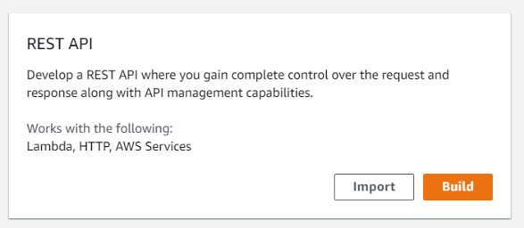
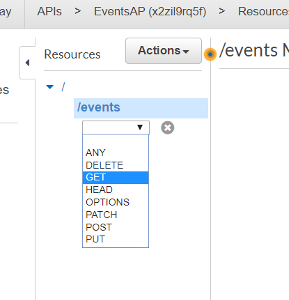
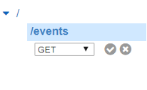
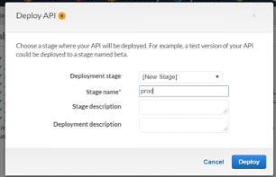

# Laboratorio 4.  Crear API Gateway sin seguridad

Una vez creada la función deberemos crear un método para hacerla accesible a nuestra aplicación front. Para hacerlo utilizaremos el servicio API GATEWAY. Con él podemos crear API RESTful y API WebSocket que permiten aplicaciones de comunicación bidireccional en tiempo real. 
En este laboratorio por tanto crearemos un API Restful para publicar las funciones lambda que vayamos creando. Esta API utilizará Cognito para la autenticación, de forma que la proveeremos de la capa de seguridad.
1.	En la consola de AWS, en el menú Services buscaremos y seleccionaremos “API Gateway”.                                 :warning: **Hay que verificar que te encuentras en la región correcta. Cada uno de los servicios que se creen en los laboratorios (Cognito, API Gateway, Lambda y DynamoDB) deben pertenecer a la misma región.**
2.	Pulsamos “Create API” (esta sección puede no aparecer la primera vez y mostrarse directamente la opción “choose an API type”.
3.	En la ventana resultado, bajo la sección “Choose an API type”, seleccionamos “Rest API” y pulsamos “Build”.

    

4.	En “Create your first API” pulsamos “OK”.
5.	Debajo de “Create new API” seleccionamos “NEW API”.
6.	Introducimos la siguiente información:
    * API name: EventsAP
    * Description: EventsAP
    * Endpoint Type: Regional
    * Pulsamos “Create API”.

Crearemos ahora los “Resources” para la API.

12.	En el servicio API Gateway, dentro de la API:Events, pulsamos “Resources”.
13.	Dentro de Resources, seleccionamos el root (“/”).
14.	Pulsamos “Actions” y en el desplegable seleccionamos “Create Resource” e introducimos:
    * Name: events
15.	Pulsamos “Create Resource”.

Una vez creado el recurso debemos crear los métodos http para el recurso creado.
16.	Seleccionamos “/events” dentro de la sección Resources del API EventsAP.
17.	Pulsamos “Actions” y seleccionamos “Create Method”.
18.	Debajo del root de nuestro recurso se habrá creado un desplegable en el que seleccionaremos “GET”.

    

19.	Y pulsaremos el icono  para validarlo.

    

20.	Dentro de “/events - GET – Setup”:
    * Seleccionaremos “Lambda Function”.
    * En “Lambda Function” introduciremos “E” lo que nos permitirá seleccionar la función lambda creada “Events-List”.
21.	Pulsamos “save" para crear.
22.	En el dialogo resultante “Add Permission to Lambda Function”, confirmaremos la creación pulsando “OK”.
23.	Pulsamos en el resource “/events”.
24.	Desplegamos “Actions” y seleccionamos “enable CORS”.
25.	Pulsamos “Enable CORS and replace existing CORS headers”.
26.	Pulsamos “Actions” y seleccionamos “Deploy API”, haciendo los siguientes cambios:
    * Deployment stage: [New Stage]
    * Stage name: prod

    

27.	Pulsamos deploy.
28.	Copiamos el valor de “Invoke URL”, lo necesitaremos después.
29.	Pulsamos la pestaña “Logs/Tracing”.
30.	En la configuración de Cloudwatch, marcamos “Enable CloudWatch Logs”.
31.	Seleccionamos INFO como log level.
32.	Marcamos “Log full requests/responses data”
33.	Pulsamos “Save changes”.
