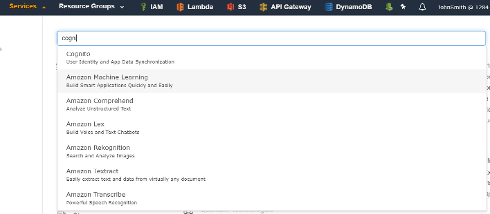
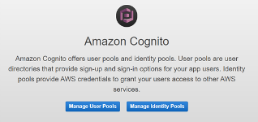
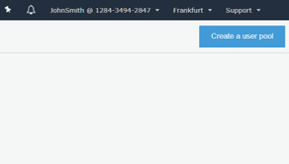
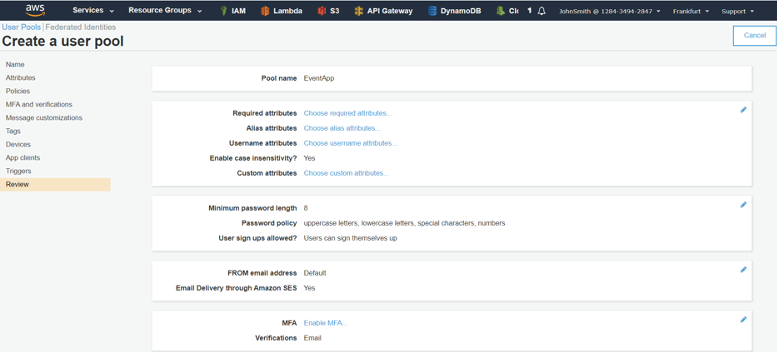
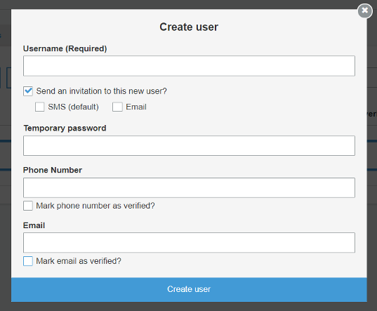

# Laboratorio 5. Cognito
AWS Cognito provee a nuestros servicios de AWS de la capa se seguridad necesaria para el control del acceso. Cognito provee de tres servicios:
-	Amazon Cognito Federated Identities 
-	Amazon Cognito User Pools
-	Amazon Cognito Sync

Para nuestra aplicación utilizaremos un User Pool:
-	Crearemos un “Cognito User Pool” para el control de acceso de los usuarios finales de nuestra aplicación a una API Gateway, dotando de seguridad a nuestra aplicación.
-	Añadiremos un usuario en el pool para realizar las pruebas de funcionamiento.

## Creación del User Pool
Para crearlo seguiremos los siguientes pasos:
1.	En la consola de AWS, en el menú Services buscaremos y seleccionaremos “Cognito”.

  

> Hay que verificar que te encuentras en la región correcta. Cada uno de los servicios que se creen en los laboratorios (Cognito, API Gateway, Lambda y DynamoDB) deben pertenecer a la misma región.

2.	Crearemos un nuevo pool de usuarios pulsando “Manage User Pools” y “Create a user pool”.

  

  

3.	Introduce un nombre para el pool: “EventAppPool” y pulsa “Step through settings”.
4.  En la sección How do you want your end users to sign in?, elejimos Email address or phone number.
4.	En la sección “Which standard attributes do you want to require”, debemos dejar todo vacio. Pulsaremos luego “next step”.
5.	En la siguiente sección “What password strength do you want to require”, estableceremos las limitaciones para las password, puedes cambiar
    *	La longitud mínima de la password: la dejamos en 6
    *	Obligatoriedad de caracteres especiales, mayúsculas...: por comodidad, quitamos todas.
El resto de las opciones las dejaremos por defecto y pulsaremos “next step”.
6.	Para establecer las propiedades del pool, en el menú de la derecha veremos cada una de las secciones necesarias. Podemos ahora saltar hasta el paso “App clients”, pulsando sobre la sección, dejando las secciones intermedias con los valores por defecto.
7.	En la sección “App clients” pulsamos “Add an app client” y en el formulario resultante establecemos las propiedades del cliente:
    *	Nombre de la aplicación “EventAppAngular”.
    *	Deseleccionamos “Generate client secret”.
Y pulsamos “Create app client” (estos pasos son muy importantes ya que no podrán ser modificados después de crear el app client). Con ello el “app client” habrá sido creado.
8.	En el menú de la izquierda, donde se encuentran las secciones del pool, pulsaremos “Review” para revisar toda las configuraciones establecidas. Y pulsamos “Create pool”. Deberemos navegar a una ventana donde veremos el mensaje “Your user pool was created successfully.”

  

9.	De la ventana donde nos informan que hemos creado el pool, debemos copiar y salvar: el “Pool id” y el “Pool ARN”, los utilizaremos más tarde en nuestra aplicación:
    * Pool Id: eu-central-1_XXXXXXXX
    * Pool ARN: arn:aws:cognito-idp:eu-central-1:128434942847:userpool/eu-central-1_XXXXXXX.
10.	En el panel de navegación a la izquierda, dentro de “General Settings”, pulsaremos “App Clients” y salvaremos también el “App client id” de la app client “EventAppAngular”.

## Creación de un usuario para el User Pool

1.	Dentro de la ventana de administración del user pool que hemos creado (AWS Service “Cognito”, opción “Manage User Pool”, seleccionando el user pool “EventApp”), en el panel de navegación a la izquierda, dentro de “General Settings”, pulsaremos “User and Groups” y “create user”.
2.	En la ventana emergente introduciremos el nombre “test-user” y la contraseña que prefiramos (aunque tendrá que cumplir las condiciones que especificamos en la creación del userpool----Test-user1234), desmarcando el envío de invitación y las verificaciones del teléfono y el email. 

  

