# Laboratorio 6. Completar API Gateway

## Introducción

En los laboratorios anteriores creamos el endpoint para acceder a la función lambda que obtiene y devuelve todos los eventos creados en la base de datos utilizando API Gateway. Ahora vamos a crear el resto de endpoint:

1. POST /events: para crear un evento.
3. GET /events/{eventid}: para obtener un evento.
2. PUT /events/{eventid}: para editar un evento.
3. DELETE /events/{eventid}: para eliminar un evento.
4. GET /events/me: para obtener los eventos creados por el usuario autenticado.

Ademas, vamos a añadirle a todos los endpoints dos capas de seguridad para controlar quien puede acceder.
* **Token de usuario**: vamos a añadir la cabecera Authorization, de forma que solo los usuarios autenticados puedan ver los eventos.
* **API Key**: vamos a añadir la cabecera x-api-key, para limitar el uso de nuestra api añadiendo un plan de uso. El objeto de este plan de uso es garantizar que en el caso que alguien acceda a la URL de vuestra API, no pueda saturarla con miles de peticiones.

Para llevar a cabo la parte de token de usuario, debemos crear un Authorizer con el pool de usuarios que hemos creado en los laboratorios anteriores.

## API Key y Usage Plan

Para crear el API Key hacemos los siguientes pasos:

1. Con la API abierta, hacemos click en la opción API Keys del menú de la izquierda.
2. Pinchamos en Actions, y luego en Create API Key.
3. En el formulario, ponemos un nombre (p. ej. "identification") y damos a Save.
4. Nos aparecerá la información del API Key. Si hacemos click en Show, podemos ver la clave. Guardala, porque la necesitaras más adelante. 

Ahora vamos a asociarle un plan de uso al API key:

1. Volvemos a la API y hacemos click en la opción Usages Plan del menú de la izquierda.
2. Pinchamos en Create.
3. En el formulario:
  * Name: indicamos un nombre significativo (p. ej. "EventsUsagePlan").
  * Enable throttling: lo dejamos habilitado. 
  * Rate: 1
  * Burst: 1
  * Enable quota: lo dejamos habilitado
  * Requests per: 200 per month
Como véis, hemos establecido los límites de peticiones por segundo que pueden recibir y el máximo total que nuestra API admitirá al mes.
4. Hacemos click en Next.
Ahora vamos a seleccionar la API y dentro de ella, el deploy stage al que queremos aplicar el Usage Plan. En nuestro caso solo tenemos un previamente creado ("prod"). 
5. Hacemos click en Add Api Stage.
6. En API, elegimos el nombre de nuestra API.
7. En Stage, elejimos el stage, ("prod" si hemos seguido las instrucciones anteriores). Hacemos click en el icono de Ok del registro añadido.
8. Hacemos click en Next.
9. Hacemos click en Add API Key to Usage Plan.
10. En name indicamos el nombre de nuestra API key ("identification" en nuestro ejemplo) y hacemos click en el icono de Ok.
11. Hacemos click en done. 

De esta forma, ya tenemos un plan de uso asociado al stage de nuestra API. 

## Creación de un Authorizer

Para poder hacer uso de la autorización a través de Cognito, es necesario crear un Authorizer con el pool de usuarios que hemos creado anteriormente.

1. Entramos en el servicio API Gateway y en el menú de la izquierda, pulsamos sobre Authorizers

<p align="center">
  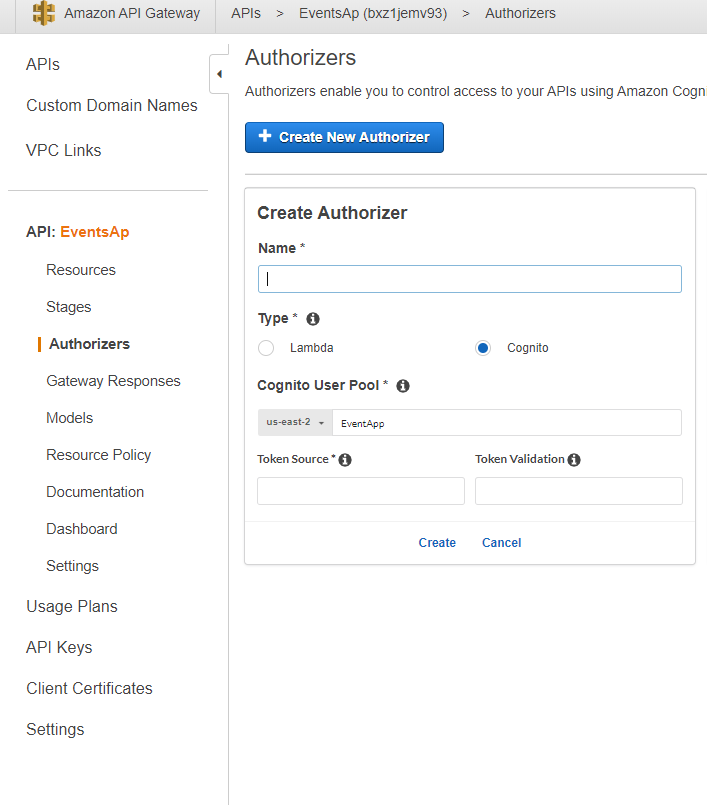
</p>

2. Rellenamos el nombre del authorizer.
3. En la opción tipo, seleccionamos Cognito
4. En la sección Cognito User Pool introducimos el nombre del pool que hemos creado en cognito.
5. En Token source (Origen del token), escribimos Authorization.
6. Pulsamos Create 

## Preparar Postman

Para probar la API, vamos a utilizar postman. El fichero con la descripción de la API está en el siguiente enlace: [postman_collection.json](./resources/events-app.postman_collection.json).
El primer paso es importar el fichero en postman:

1. Abrimos Postman
2. Hacemos click en import

<p align="center">
    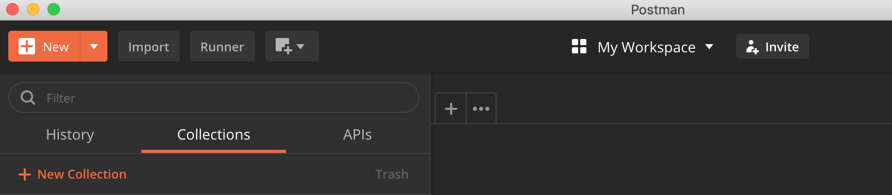
</p>

3. Hacemos click en choose files y elejimos el json que hemos descargado.

<p align="center">
    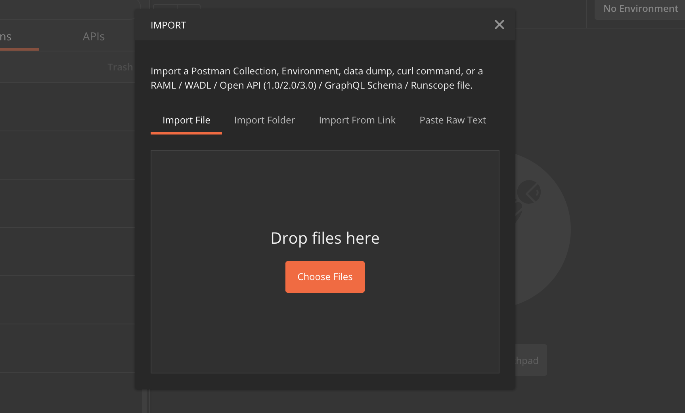
</p>

Esto nos creará una nueva colección que podemos ver en el menú de la izquierda, con los 6 endpoints que acabamos de crear.

<p align="center">
    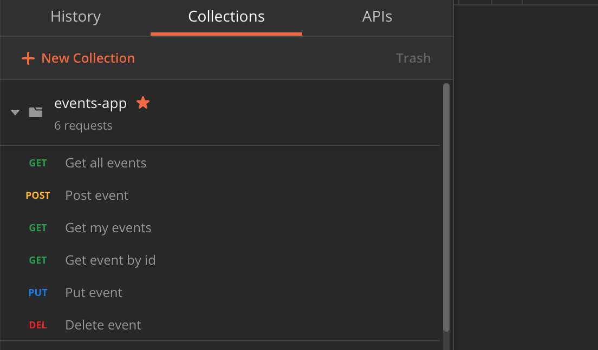
</p>

Además, necesitamos importar el [entorno](./resources/events.postman_environment.json) con las variables que necesitaremos para probar nuestra API:

1. Hacemos click en import
2. Hacemos click en choose files y elejimos el json que hemos descargado.

<p align="center">
    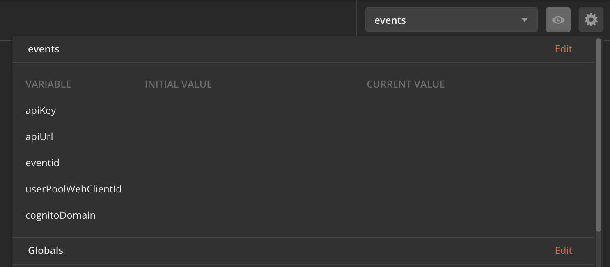
</p>

Esto nos creará un nuevo entorno en postman llamado events con las siguientes variables:

1. apiKey: es la api key creada anteriormente
2. apiUrl: es la url de nuestra api
3. eventid: es el id de algún evento creado en la base de datos
4. userPoolWebClientId: es el client id de nuestra app en cognito
5. cognitoDomain: es el dominio creado en cognito de nuestra app en el laboratorio 5.

Simplemente hay que editarlas:

1. Hacemos click en el icono que es un ojo.
2. Al lado de cada variable, hacemos click en el lapiz

<p align="center">
    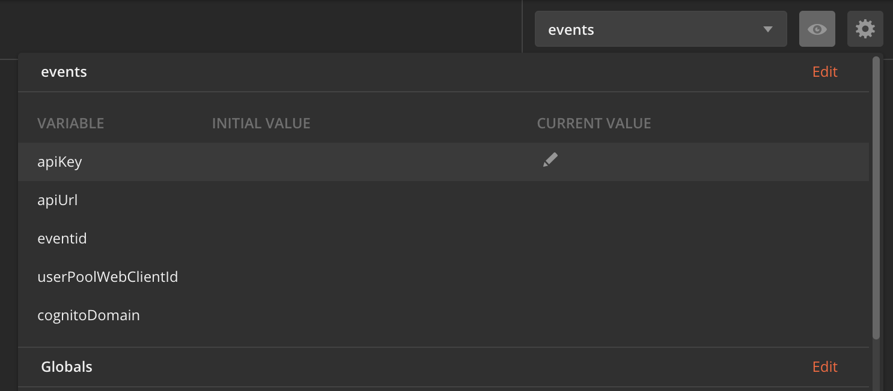
</p>

3. Indicamos el valor de cada variable

Para probar cada endpoint: 
1. Hacemos click en el, desde el menú de la izquierda.

<p align="center">
    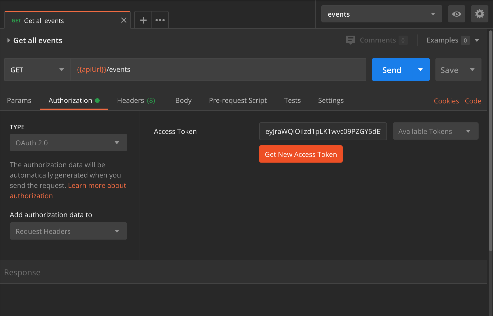
</p>

2. En la pestaña Authorization, hacemos click en Get New Access Token.

<p align="center">
    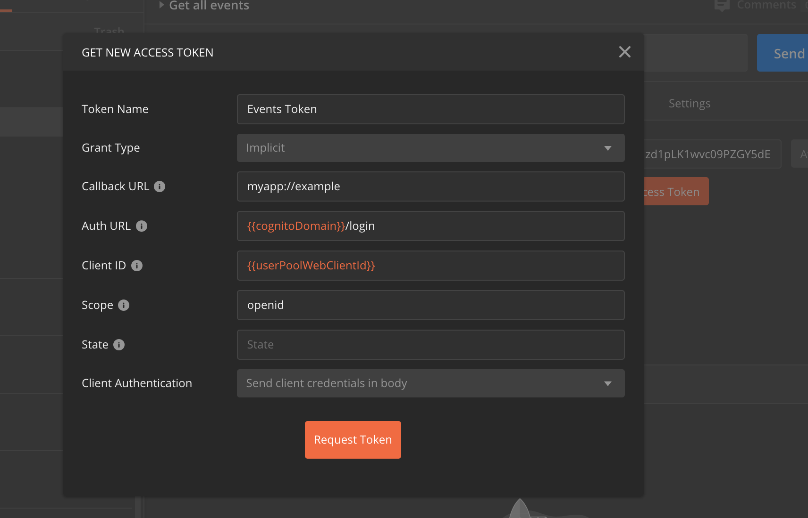
</p>

3. En la ventana abierta:
   * Token name: Events Token
   * Grant type: Implicit
   * Callback URL: myapp://example
   * AuthURL: {{cognitoDomain}}/login
   * Client ID: {{userPoolWebClientId}}
   * Scope: openid
   * State: lo dejamos vacio
   * Client Authentication: Send client credentials in body
4. Hacemos click en Request token.
5. En la ventana abierta, usamos el usuario que creamos en el laboratorio 5.

<p align="center">
    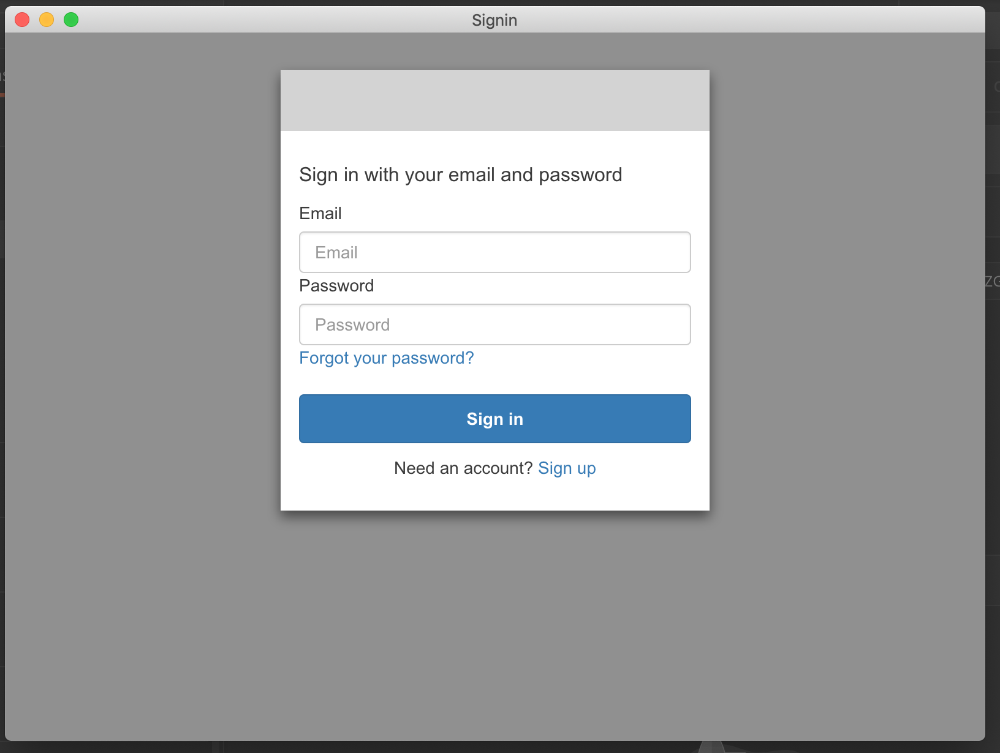
</p>

6. Al iniciar sesión, veremos que hemos obtenido un nuevo token.

<p align="center">
    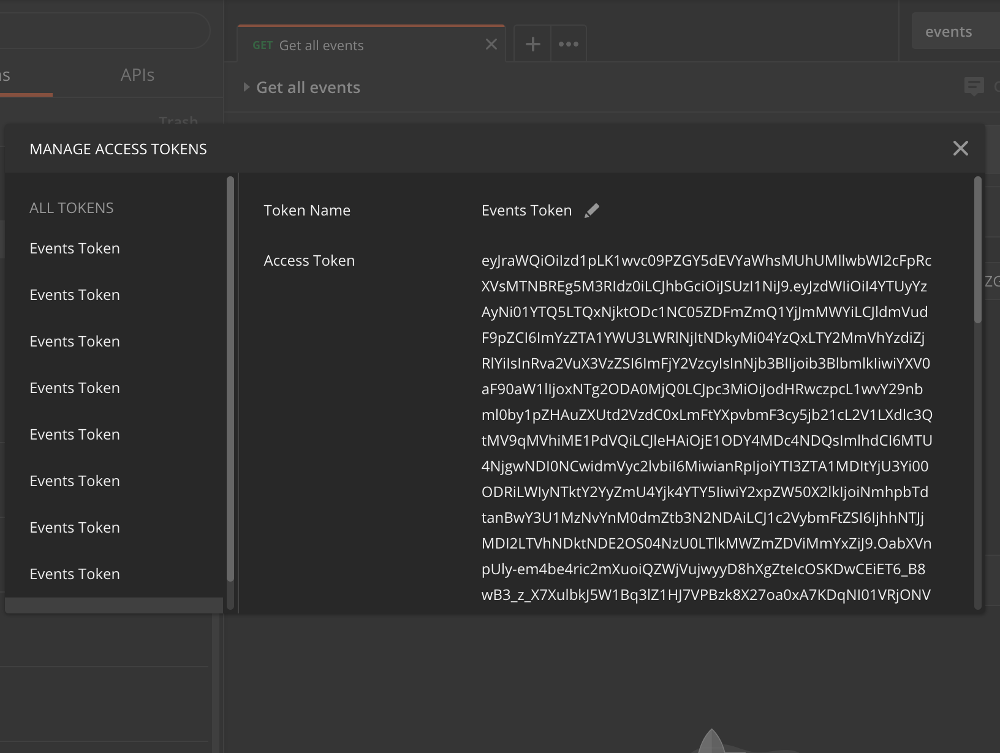
</p>

7. Bajamos el scroll, y hacemos click en use token.

<p align="center">
    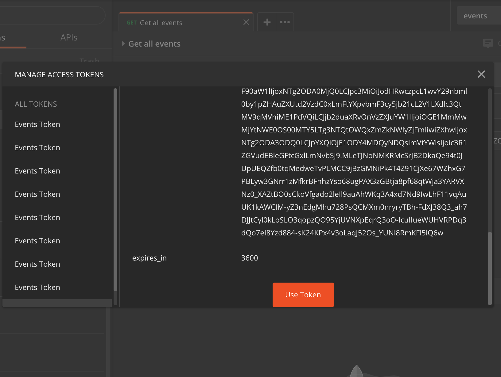
</p>

6. Finalmente, hacemos click en send y veremos la respuesta.


## GET /events endpoint

Vamos a añadirle la capa de seguridad al endpoint GET /events de nuestra API:

1. Con la API abierta, pinchamos en /events > GET
2. Hacemos click en Method Request.
3. En la sección de settings:
 * En Authorization vamos a seleccionar elejimos la pool creada.
 * En OAuth Scopes, lo dejamos a openid                                                                                      :warning:(Esto solo es por propósitos de testing para usarlo desde Postman. Cuando lo integremos con la app, lo dejaremos a None).:warning:
 * En Request Validator, lo dejamos a None.
 * En API Key Required, lo dejamos a True.
 
De esta forma, para usar el endpoint GET /events, se va a necesitar el Api key y un token de usuario.

### Probar endpoint

Lo primero que tenemos que hacer es desplegar la API:

1. Click en Actions.
2. Click en Enable CORS
3. Click en Enable CORS and replace existing CORS headers
4. Volvemos atrás y hacemos click en Actions.
5. Click en Deploy API.
6. Elegimos el stage y damos a Deploy

Después, abrimos postman:

1. Nos aseguramos que estamos usando el entorno events.
2. Hacemos click en Get All events, en el menu de la izquierda en la colección events.
3. Vamos a la pestaña Authorization y nos aseguramos que el campo Access Token está relleno. En caso de que no, damos a Get access Token, y seguimos los pasos [anteriores](https://github.com/josdev27/openathon-2020-serverless/tree/master/lab-06#preparar-postman).
4. Hacemos click en Send, y deberiamos de recibir un 200 OK. En caso de que recibamos un 401, tenemos que generar un nuevo token. Para ellos, vamos a la pestaña Authorization, y damos a Get Access Token, y seguimos los pasos [anteriores](https://github.com/josdev27/openathon-2020-serverless/tree/master/lab-06#preparar-postman).


Finalmente, volvemos al Api Gateway, y dentro de method request, debemos dejar el campo Oauth Request a None.

## POST /events endpoint

A través de este endpoint se podrán crear nuevos eventos.

[Crear función lambda >](../lambda-functions-python/CreateEvent)

[Crear función java >](../lambda-functions-java/CreateEvent)


### Crear endpoint

Para crear el endpoint en nuestro API Gateway:

1. Pinchamos en /events
2. Hacemos click en Actions y luego en Create Method. Elejimos POST.
2. Hacemos click en method request.
3. En la sección de settings:
 * En Authorization, elejimos la pool creada.
 * En OAuth Scopes, lo dejamos a None.
 * En Request Validator, lo dejamos a None.
 * En API Key Required, lo dejamos a True.
4. Volvemos atrás, y hacemos click en Integration Request:
 * En Integration type, elejimos Lambda Function.
 * En Lambda Region, la region correspondiente.
 * En Lambda Function, la funcion lambda para crear eventos.
 
### Probar endpoint

Lo primero que tenemos que hacer es desplegar la API:

1. Click en Actions.
2. Click en Enable CORS
3. Click en Enable CORS and replace existing CORS headers
4. Volvemos atrás y hacemos click en Actions.
5. Click en Deploy API.
6. Elegimos el stage y damos a Deploy

Después, abrimos postman:

1. Nos aseguramos que estamos usando el entorno events.
2. Hacemos click en Post events, en el menu de la izquierda en la colección events.
3. Vamos a la pestaña Authorization y nos aseguramos que el campo Access Token está relleno. En caso de que no, damos a Get access Token, y seguimos los pasos [anteriores](https://github.com/josdev27/openathon-2020-serverless/tree/master/lab-06#preparar-postman).
4. Hacemos click en Send, y deberiamos de recibir un 200 OK. En caso de que recibamos un 401, tenemos que generar un nuevo token. Para ellos, vamos a la pestaña Authorization, y damos a Get Access Token, y seguimos los pasos [anteriores](https://github.com/josdev27/openathon-2020-serverless/tree/master/lab-06#preparar-postman).


Finalmente, volvemos al Api Gateway, y dentro de method request, debemos dejar el campo Oauth Request a None.


## GET /events/me endpoint

Este endpoint nos permitirá obtener los eventos del usuario logueado.

### Crear función lambda

[Crear función lambda >](../lambda-functions-python/GetEventsMe)

[Crear función java >](../lambda-functions-java/GetEventsMe)

### Crear endpoint

Para crear el endpoint en nuestro API Gateway:

1. Pinchamos en /events
2. Hacemos click en Actions y luego en Create Resource:
   * En Resource Name: Mis eventos
   * Resource Path: me
3. Hacemos click en Create Reosurce.
4. Hacemos click en /me. Luego En Actions y en Create Method. Elejimos GET.
4. Hacemos click en method request.
5. En la sección de settings:
 * En Authorization, elejimos la pool creada.
 * En OAuth Scopes, lo dejamos a openid                                                                                      :warning:(Esto solo es por propósitos de testing para usarlo desde Postman. Cuando lo integremos con la app, lo dejaremos a None).:warning:
 * En Request Validator, lo dejamos a None.
 * En API Key Required, lo dejamos a True.
6. Volvemos atrás, y hacemos click en Integration Request:
 * En Integration type, elejimos Lambda Function.
 * En Lambda Region, la region correspondiente.
 * En Lambda Function, la funcion lambda para listar eventos.
 * En Mappings Template:
   * Hacemos click en When there are no templates defined (recommended)
   * Hacemos click en Add Mapping Template y escribimos application/json
   * En el editor que se nos ha abierto ponemos:
   ```json
   {
   "addedBy" : "$context.authorizer.claims.email"
   }
   ```
   * Hacemos click en Save

### Probar endpoint

Lo primero que tenemos que hacer es desplegar la API:

1. Click en Actions.
2. Click en Enable CORS
3. Click en Enable CORS and replace existing CORS headers
4. Volvemos atrás y hacemos click en Actions.
5. Click en Deploy API.
6. Elegimos el stage y damos a Deploy

Después, abrimos postman:

1. Nos aseguramos que estamos usando el entorno events.
2. Hacemos click en Get my events, en el menu de la izquierda en la colección events.
3. Vamos a la pestaña Authorization y nos aseguramos que el campo Access Token está relleno. En caso de que no, damos a Get access Token, y seguimos los pasos [anteriores](https://github.com/josdev27/openathon-2020-serverless/tree/master/lab-06#preparar-postman).
4. Hacemos click en Send, y deberiamos de recibir un 200 OK. En caso de que recibamos un 401, tenemos que generar un nuevo token. Para ellos, vamos a la pestaña Authorization, y damos a Get Access Token, y seguimos los pasos [anteriores](https://github.com/josdev27/openathon-2020-serverless/tree/master/lab-06#preparar-postman).


Finalmente, volvemos al Api Gateway, y dentro de method request, debemos dejar el campo Oauth Request a None.

## GET /events/{eventsId} endpoint

Este endpoint nos permitirá obtener los eventos del usuario logueado.

### Crear función lambda

[Crear función lambda >](../lambda-functions-python/GetEventId)

[Crear función java >](../lambda-functions-java/GetEventId)


### Crear endpoint

Para crear el endpoint en nuestro API Gateway:

1. Pinchamos en /events
2. Hacemos click en Actions y luego en Create Resource:
   * En Resource Name: Eventos por id
   * Resource Path: {eventid}
3. Hacemos click en Create Resource.
4. Hacemos click en {eventid}. Luego En Actions y en Create Method. Elejimos GET.
4. Hacemos click en method request.
5. En la sección de settings:
 * En Authorization, elejimos la pool creada.
 * En OAuth Scopes, lo dejamos a openid                                                                                      :warning:(Esto solo es por propósitos de testing para usarlo desde Postman. Cuando lo integremos con la app, lo dejaremos a None).:warning:
 * En Request Validator, lo dejamos a None.
 * En API Key Required, lo dejamos a True.
6. Volvemos atrás, y hacemos click en Integration Request:
 * En Mappings Template:
   * Hacemos click en When there are no templates defined (recommended)
   * Hacemos click en Add Mapping Template y escribimos application/json
   * En el editor que se nos ha abierto ponemos:
   ```json
   {
   "id": "$input.params('eventid')"
   }
   ```
   * Hacemos click en Save

### Probar endpoint

Lo primero que tenemos que hacer es desplegar la API:

1. Click en Actions.
2. Click en Enable CORS
3. Click en Enable CORS and replace existing CORS headers
4. Volvemos atrás y hacemos click en Actions.
5. Click en Deploy API.
6. Elegimos el stage y damos a Deploy

Después, abrimos postman:

1. Nos aseguramos que estamos usando el entorno events.
2. Hacemos click en Get event by id, en el menu de la izquierda en la colección events.
3. Vamos a la pestaña Authorization y nos aseguramos que el campo Access Token está relleno. En caso de que no, damos a Get access Token, y seguimos los pasos [anteriores](https://github.com/josdev27/openathon-2020-serverless/tree/master/lab-06#preparar-postman).
4. Hacemos click en Send, y deberiamos de recibir un 200 OK. En caso de que recibamos un 401, tenemos que generar un nuevo token. Para ellos, vamos a la pestaña Authorization, y damos a Get Access Token, y seguimos los pasos [anteriores](https://github.com/josdev27/openathon-2020-serverless/tree/master/lab-06#preparar-postman).


Finalmente, volvemos al Api Gateway, y dentro de method request, debemos dejar el campo Oauth Request a None.


## PUT /events/{eventsId} endpoint

Este endpoint nos permitirá editar un evento.

### Crear función lambda

[Crear función lambda >](../lambda-functions-python/EditEventId)

[Crear función java >](../lambda-functions-java/EditEventId)

### Crear endpoint

Para crear el endpoint en nuestro API Gateway:

1. Hacemos click en {eventid}. Luego En Actions y en Create Method. Elejimos GET.
2. Hacemos click en method request.
3. En la sección de settings:
 * En Authorization, elejimos la pool creada.
 * En OAuth Scopes, lo dejamos a openid                                                                                      :warning:(Esto solo es por propósitos de testing para usarlo desde Postman. Cuando lo integremos con la app, lo dejaremos a None).:warning:
 * En Request Validator, lo dejamos a None.
 * En API Key Required, lo dejamos a True.
4. Volvemos atrás, y hacemos click en Integration Request:
 * En Mappings Template:
   * Hacemos click en When there are no templates defined (recommended)
   * Hacemos click en Add Mapping Template y escribimos application/json
   * En el editor que se nos ha abierto ponemos:
   ```json
   {
   "body-json" : $input.json('$'),
   "id": "$input.params('eventid')",
   "addedBy" : "$context.authorizer.claims.email"
   }
   ```
   * Hacemos click en Save

### Probar endpoint

Lo primero que tenemos que hacer es desplegar la API:

1. Click en Actions.
2. Click en Enable CORS
3. Click en Enable CORS and replace existing CORS headers
4. Volvemos atrás y hacemos click en Actions.
5. Click en Deploy API.
6. Elegimos el stage y damos a Deploy

Después, abrimos postman:

1. Nos aseguramos que estamos usando el entorno events.
2. Hacemos click en Put event, en el menu de la izquierda en la colección events.
3. Vamos a la pestaña Authorization y nos aseguramos que el campo Access Token está relleno. En caso de que no, damos a Get access Token, y seguimos los pasos [anteriores](https://github.com/josdev27/openathon-2020-serverless/tree/master/lab-06#preparar-postman).
4. Hacemos click en Send, y deberiamos de recibir un 200 OK. En caso de que recibamos un 401, tenemos que generar un nuevo token. Para ellos, vamos a la pestaña Authorization, y damos a Get Access Token, y seguimos los pasos [anteriores](https://github.com/josdev27/openathon-2020-serverless/tree/master/lab-06#preparar-postman).


Finalmente, volvemos al Api Gateway, y dentro de method request, debemos dejar el campo Oauth Request a None.


## DELETE /events/{eventsId} endpoint

Este endpoint nos permitirá borrar un evento.

### Crear función lambda

[Crear función lambda >](../lambda-functions-python/DeleteEventId)

[Crear función java >](../lambda-functions-java/DeleteEventId)


### Crear endpoint

Para crear el endpoint en nuestro API Gateway:

1. Hacemos click en {eventid}. Luego En Actions y en Create Method. Elejimos GET.
2. Hacemos click en method request.
3. En la sección de settings:
 * En Authorization, elejimos la pool creada.
 * En OAuth Scopes, lo dejamos a openid                                                                                      :warning:(Esto solo es por propósitos de testing para usarlo desde Postman. Cuando lo integremos con la app, lo dejaremos a None).:warning:
 * En Request Validator, lo dejamos a None.
 * En API Key Required, lo dejamos a True.
4. Volvemos atrás, y hacemos click en Integration Request:
 * En Mappings Template:
   * Hacemos click en When there are no templates defined (recommended)
   * Hacemos click en Add Mapping Template y escribimos application/json
   * En el editor que se nos ha abierto ponemos:
   ```json
   {
   "id": "$input.params('eventid')",
   "addedBy" : "$context.authorizer.claims.email"
   }
   ```
   * Hacemos click en Save

### Probar endpoint

Lo primero que tenemos que hacer es desplegar la API:

1. Click en Actions.
2. Click en Enable CORS
3. Click en Enable CORS and replace existing CORS headers
4. Volvemos atrás y hacemos click en Actions.
5. Click en Deploy API.
6. Elegimos el stage y damos a Deploy

Después, abrimos postman:

1. Nos aseguramos que estamos usando el entorno events.
2. Hacemos click en Delete event, en el menu de la izquierda en la colección events.
3. Vamos a la pestaña Authorization y nos aseguramos que el campo Access Token está relleno. En caso de que no, damos a Get access Token, y seguimos los pasos [anteriores](https://github.com/josdev27/openathon-2020-serverless/tree/master/lab-06#preparar-postman).
4. Hacemos click en Send, y deberiamos de recibir un 200 OK. En caso de que recibamos un 401, tenemos que generar un nuevo token. Para ellos, vamos a la pestaña Authorization, y damos a Get Access Token, y seguimos los pasos [anteriores](https://github.com/josdev27/openathon-2020-serverless/tree/master/lab-06#preparar-postman).


Finalmente, volvemos al Api Gateway, y dentro de method request, debemos dejar el campo Oauth Request a None.

## Resumen

En este laboratorio, hemos completado el resto de nuestra API. Además, la hemos securizado haciendo uso de cognito y de un plan de uso asociado a un api-key para controlar el consumo. 
El siguiente paso, es integrarla con nuestra aplicación frontend.

[< Lab 05 ](../lab-05)  | [Lab 07 >](../lab-07)
