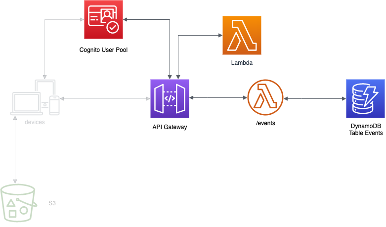

<p align="center">
    
</p>

# Laboratorio 7. Completar la API

## Introducción

<p align="center">
    
</p>

En el laboratorio anterior hemos securizado el endpoint que nos devuelve todos los eventos. Ahora vamos a crear y securizar el resto de endpoint:

1. **POST /events**: para crear un evento.
3. **GET /events/{eventid}**: para obtener un evento.
2. **PUT /events/{eventid}**: para editar un evento.
3. **DELETE /events/{eventid}**: para eliminar un evento.
4. **GET /events/me**: para obtener los eventos creados por el usuario autenticado.


## POST /events endpoint

A través de este endpoint se podrán crear nuevos eventos.

[Crear función python >](../lambda-functions-python/CreateEvent)

[Crear función java >](../lambda-functions-java/CreateEvent)


### Crear endpoint

Para crear el endpoint en nuestro API Gateway:

1. Pinchamos en /events
2. Hacemos click en Actions y luego en Create Method. Elejimos POST.
2. Hacemos click en method request.
3. En la sección de settings:
 * En Authorization, elejimos la pool creada.
 * En OAuth Scopes, lo dejamos a None.
 * En Request Validator, lo dejamos a None.
 * En API Key Required, lo dejamos a True.
4. Volvemos atrás, y hacemos click en Integration Request:
 * En Integration type, elejimos Lambda Function.
 * En Lambda Region, la region correspondiente.
 * En Lambda Function, la funcion lambda para crear eventos.
 
### Probar endpoint

Lo primero que tenemos que hacer es desplegar la API:

1. Click en Actions.
2. Click en Enable CORS
3. Click en Enable CORS and replace existing CORS headers
4. Volvemos atrás y hacemos click en Actions.
5. Click en Deploy API.
6. Elegimos el stage y damos a Deploy

Después, abrimos postman:

1. Nos aseguramos que estamos usando el entorno events.
2. Hacemos click en Post events, en el menu de la izquierda en la colección events.
3. Vamos a la pestaña Authorization y nos aseguramos que el campo Access Token está relleno. En caso de que no, damos a Get access Token, y seguimos los pasos [anteriores](https://github.com/josdev27/openathon-2020-serverless/tree/master/lab-06#preparar-postman).
4. Hacemos click en Send, y deberiamos de recibir un 200 OK. En caso de que recibamos un 401, tenemos que generar un nuevo token. Para ellos, vamos a la pestaña Authorization, y damos a Get Access Token, y seguimos los pasos [anteriores](https://github.com/josdev27/openathon-2020-serverless/tree/master/lab-06#preparar-postman).


Finalmente, volvemos al Api Gateway, y dentro de method request, debemos dejar el campo Oauth Request a None.


## GET /events/me endpoint

Este endpoint nos permitirá obtener los eventos del usuario logueado.

### Crear función lambda

[Crear función python >](../lambda-functions-python/GetEventsMe)

[Crear función java >](../lambda-functions-java/GetEventsMe)

### Crear endpoint

Para crear el endpoint en nuestro API Gateway:

1. Pinchamos en /events
2. Hacemos click en Actions y luego en Create Resource:
   * En Resource Name: Mis eventos
   * Resource Path: me
3. Hacemos click en Create Reosurce.
4. Hacemos click en /me. Luego En Actions y en Create Method. Elejimos GET.
4. Hacemos click en method request.
5. En la sección de settings:
 * En Authorization, elejimos la pool creada.
 * En OAuth Scopes, lo dejamos a openid                                                                                      :warning:(Esto solo es por propósitos de testing para usarlo desde Postman. Cuando lo integremos con la app, lo dejaremos a None).:warning:
 * En Request Validator, lo dejamos a None.
 * En API Key Required, lo dejamos a True.
6. Volvemos atrás, y hacemos click en Integration Request:
 * En Integration type, elejimos Lambda Function.
 * En Lambda Region, la region correspondiente.
 * En Lambda Function, la funcion lambda para listar eventos.
 * En Mappings Template:
   * Hacemos click en When there are no templates defined (recommended)
   * Hacemos click en Add Mapping Template y escribimos application/json
   * En el editor que se nos ha abierto ponemos:
   ```json
   {
   "addedBy" : "$context.authorizer.claims.email"
   }
   ```
   * Hacemos click en Save

### Probar endpoint

Lo primero que tenemos que hacer es desplegar la API:

1. Click en Actions.
2. Click en Enable CORS
3. Click en Enable CORS and replace existing CORS headers
4. Volvemos atrás y hacemos click en Actions.
5. Click en Deploy API.
6. Elegimos el stage y damos a Deploy

Después, abrimos postman:

1. Nos aseguramos que estamos usando el entorno events.
2. Hacemos click en Get my events, en el menu de la izquierda en la colección events.
3. Vamos a la pestaña Authorization y nos aseguramos que el campo Access Token está relleno. En caso de que no, damos a Get access Token, y seguimos los pasos [anteriores](https://github.com/josdev27/openathon-2020-serverless/tree/master/lab-06#preparar-postman).
4. Hacemos click en Send, y deberiamos de recibir un 200 OK. En caso de que recibamos un 401, tenemos que generar un nuevo token. Para ellos, vamos a la pestaña Authorization, y damos a Get Access Token, y seguimos los pasos [anteriores](https://github.com/josdev27/openathon-2020-serverless/tree/master/lab-06#preparar-postman).


Finalmente, volvemos al Api Gateway, y dentro de method request, debemos dejar el campo Oauth Request a None.

## GET /events/{eventsId} endpoint

Este endpoint nos permitirá obtener los eventos del usuario logueado.

### Crear función lambda

[Crear función python >](../lambda-functions-python/GetEventId)

[Crear función java >](../lambda-functions-java/GetEventId)


### Crear endpoint

Para crear el endpoint en nuestro API Gateway:

1. Pinchamos en /events
2. Hacemos click en Actions y luego en Create Resource:
   * En Resource Name: Eventos por id
   * Resource Path: {eventid}
3. Hacemos click en Create Resource.
4. Hacemos click en {eventid}. Luego En Actions y en Create Method. Elejimos GET.
4. Hacemos click en method request.
5. En la sección de settings:
 * En Authorization, elejimos la pool creada.
 * En OAuth Scopes, lo dejamos a openid                                                                                      :warning:(Esto solo es por propósitos de testing para usarlo desde Postman. Cuando lo integremos con la app, lo dejaremos a None).:warning:
 * En Request Validator, lo dejamos a None.
 * En API Key Required, lo dejamos a True.
6. Volvemos atrás, y hacemos click en Integration Request:
 * En Mappings Template:
   * Hacemos click en When there are no templates defined (recommended)
   * Hacemos click en Add Mapping Template y escribimos application/json
   * En el editor que se nos ha abierto ponemos:
   ```json
   {
   "id": "$input.params('eventid')"
   }
   ```
   * Hacemos click en Save

### Probar endpoint

Lo primero que tenemos que hacer es desplegar la API:

1. Click en Actions.
2. Click en Enable CORS
3. Click en Enable CORS and replace existing CORS headers
4. Volvemos atrás y hacemos click en Actions.
5. Click en Deploy API.
6. Elegimos el stage y damos a Deploy

Después, abrimos postman:

1. Nos aseguramos que estamos usando el entorno events.
2. Hacemos click en Get event by id, en el menu de la izquierda en la colección events.
3. Vamos a la pestaña Authorization y nos aseguramos que el campo Access Token está relleno. En caso de que no, damos a Get access Token, y seguimos los pasos [anteriores](https://github.com/josdev27/openathon-2020-serverless/tree/master/lab-06#preparar-postman).
4. Hacemos click en Send, y deberiamos de recibir un 200 OK. En caso de que recibamos un 401, tenemos que generar un nuevo token. Para ellos, vamos a la pestaña Authorization, y damos a Get Access Token, y seguimos los pasos [anteriores](https://github.com/josdev27/openathon-2020-serverless/tree/master/lab-06#preparar-postman).


Finalmente, volvemos al Api Gateway, y dentro de method request, debemos dejar el campo Oauth Request a None.


## PUT /events/{eventsId} endpoint

Este endpoint nos permitirá editar un evento.

### Crear función lambda

[Crear función python >](../lambda-functions-python/EditEventId)

[Crear función java >](../lambda-functions-java/EditEventId)

### Crear endpoint

Para crear el endpoint en nuestro API Gateway:

1. Hacemos click en {eventid}. Luego En Actions y en Create Method. Elejimos GET.
2. Hacemos click en method request.
3. En la sección de settings:
 * En Authorization, elejimos la pool creada.
 * En OAuth Scopes, lo dejamos a openid                                                                                      :warning:(Esto solo es por propósitos de testing para usarlo desde Postman. Cuando lo integremos con la app, lo dejaremos a None).:warning:
 * En Request Validator, lo dejamos a None.
 * En API Key Required, lo dejamos a True.
4. Volvemos atrás, y hacemos click en Integration Request:
 * En Mappings Template:
   * Hacemos click en When there are no templates defined (recommended)
   * Hacemos click en Add Mapping Template y escribimos application/json
   * En el editor que se nos ha abierto ponemos:
   ```json
   {
   "body-json" : $input.json('$'),
   "id": "$input.params('eventid')",
   "addedBy" : "$context.authorizer.claims.email"
   }
   ```
   * Hacemos click en Save

### Probar endpoint

Lo primero que tenemos que hacer es desplegar la API:

1. Click en Actions.
2. Click en Enable CORS
3. Click en Enable CORS and replace existing CORS headers
4. Volvemos atrás y hacemos click en Actions.
5. Click en Deploy API.
6. Elegimos el stage y damos a Deploy

Después, abrimos postman:

1. Nos aseguramos que estamos usando el entorno events.
2. Hacemos click en Put event, en el menu de la izquierda en la colección events.
3. Vamos a la pestaña Authorization y nos aseguramos que el campo Access Token está relleno. En caso de que no, damos a Get access Token, y seguimos los pasos [anteriores](https://github.com/josdev27/openathon-2020-serverless/tree/master/lab-06#preparar-postman).
4. Hacemos click en Send, y deberiamos de recibir un 200 OK. En caso de que recibamos un 401, tenemos que generar un nuevo token. Para ellos, vamos a la pestaña Authorization, y damos a Get Access Token, y seguimos los pasos [anteriores](https://github.com/josdev27/openathon-2020-serverless/tree/master/lab-06#preparar-postman).


Finalmente, volvemos al Api Gateway, y dentro de method request, debemos dejar el campo Oauth Request a None.


## DELETE /events/{eventsId} endpoint

Este endpoint nos permitirá borrar un evento.

### Crear función lambda

[Crear función python >](../lambda-functions-python/DeleteEventId)

[Crear función java >](../lambda-functions-java/DeleteEventId)


### Crear endpoint

Para crear el endpoint en nuestro API Gateway:

1. Hacemos click en {eventid}. Luego En Actions y en Create Method. Elejimos GET.
2. Hacemos click en method request.
3. En la sección de settings:
 * En Authorization, elejimos la pool creada.
 * En OAuth Scopes, lo dejamos a openid                                                                                      :warning:(Esto solo es por propósitos de testing para usarlo desde Postman. Cuando lo integremos con la app, lo dejaremos a None).:warning:
 * En Request Validator, lo dejamos a None.
 * En API Key Required, lo dejamos a True.
4. Volvemos atrás, y hacemos click en Integration Request:
 * En Mappings Template:
   * Hacemos click en When there are no templates defined (recommended)
   * Hacemos click en Add Mapping Template y escribimos application/json
   * En el editor que se nos ha abierto ponemos:
   ```json
   {
   "id": "$input.params('eventid')",
   "addedBy" : "$context.authorizer.claims.email"
   }
   ```
   * Hacemos click en Save

### Probar endpoint

Lo primero que tenemos que hacer es desplegar la API:

1. Click en Actions.
2. Click en Enable CORS
3. Click en Enable CORS and replace existing CORS headers
4. Volvemos atrás y hacemos click en Actions.
5. Click en Deploy API.
6. Elegimos el stage y damos a Deploy

Después, abrimos postman:

1. Nos aseguramos que estamos usando el entorno events.
2. Hacemos click en Delete event, en el menu de la izquierda en la colección events.
3. Vamos a la pestaña Authorization y nos aseguramos que el campo Access Token está relleno. En caso de que no, damos a Get access Token, y seguimos los pasos [anteriores](https://github.com/josdev27/openathon-2020-serverless/tree/master/lab-06#preparar-postman).
4. Hacemos click en Send, y deberiamos de recibir un 200 OK. En caso de que recibamos un 401, tenemos que generar un nuevo token. Para ellos, vamos a la pestaña Authorization, y damos a Get Access Token, y seguimos los pasos [anteriores](https://github.com/josdev27/openathon-2020-serverless/tree/master/lab-06#preparar-postman).


Finalmente, volvemos al Api Gateway, y dentro de method request, debemos dejar el campo Oauth Request a None.

## Resumen

En este laboratorio, hemos completado el resto de nuestra API. Además, la hemos securizado haciendo uso de cognito y de un plan de uso asociado a un api-key para controlar el consumo. 
El siguiente paso, es integrarla con nuestra aplicación frontend.

[< Lab 06 ](../lab-06)  | [Lab 08 >](../lab-08)

<p align="center">
    
</p>

