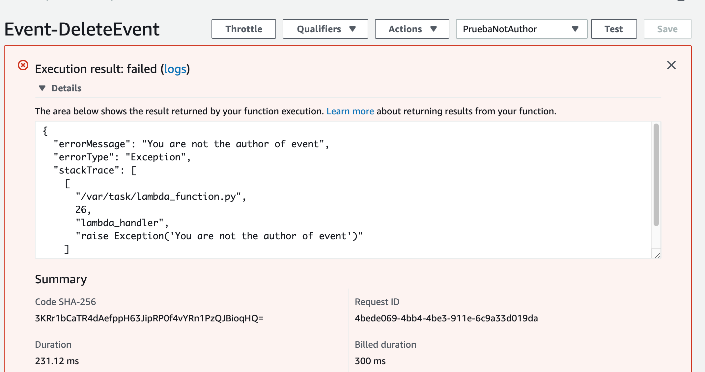

# Probar función para borrar un evento

Creamos un test de prueba cuya entrada es la siguiente:

```json
{
  "id": "939e0579-641e-4cd2-afe2-1384a2f0e816",
  "addedBy": "prueba@gmail.com"
}
```
donde,
* **id**: es un id de algún evento creado en la tabla de dynamodb.
* **addedBy**: es el correo del autor del evento.

Si el campo addedBy no se corresponde con el autor, se producirá una excepción con el mensaje 'You are not the author of event':

<p align="center">
    
</p>

[< Volver al Laboratorio 07 ](../../lab-07) 
