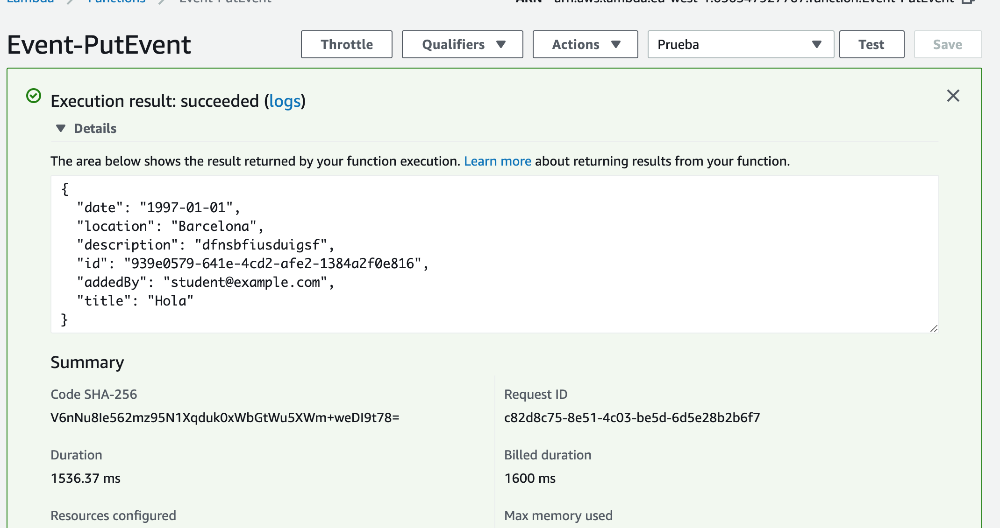

# Probar la función para editar eventos

Creamos un test de prueba cuya entrada es la siguiente:

```json
{
  "body-json": {
    "date": "1997-01-01",
    "location": "Barcelona",
    "description": "dfnsbfiusduigsf",
    "id": "939e0579-641e-4cd2-afe2-1384a2f0e816",
    "addedBy": "student@example.com",
    "title": "Hola"
  },
  "addedBy": "student@example.com",
  "id": "939e0579-641e-4cd2-afe2-1384a2f0e816"
}
```

donde,

* **id**: id del evento a editar
* **addedBy**: es el correo del autor del evento.
* **date**: fecha de creación
* **location**: localización del evento
* **description**: descripción del evento 
* **title**:: titulo del evento.

Si el campo addedBy no se corresponde con el autor, se producirá una excepción con el mensaje 'You are not the author of event':

<p align="center">
    
</p>

Si la ejecución tiene éxito, nos devolverá el evento editado:

<p align="center">
    
</p>

[< Volver al Laboratorio 07 ](../../lab-07) 
