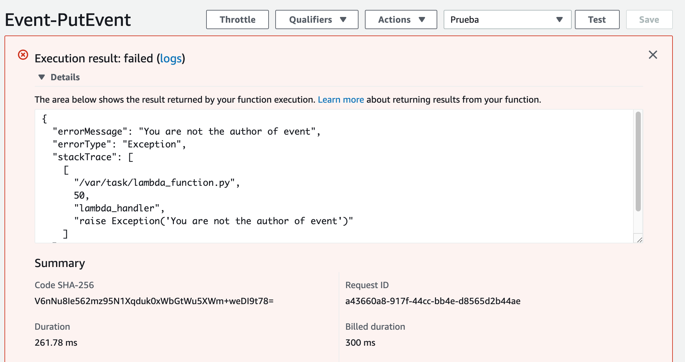

# Probar la función para editar eventos

Creamos un test de prueba cuya entrada es la siguiente:

```json
{
  "date": "1997-01-01",
  "location": "Barcelona",
  "description": "dfnsbfiusduigsf",
  "id": "3a64b9fc-bac4-47cd-a591-1813f404475e",
  "addedBy": "prueba@gmail.com",
  "title": "Hola"
}
```

donde,

* **id**: id del evento a editar
* **addedBy**: es el correo del autor del evento.
* **date**: fecha de creación
* **location**: localización del evento
* **description**: descripción del evento 
* **title**:: titulo del evento.

Si el campo addedBy no se corresponde con el autor, se producirá una excepción con el mensaje 'You are not the author of event':

<p align="center">
    
</p>

Si la ejecución tiene éxito, nos devolverá el evento editado:

<p align="center">
    
</p>

[< Volver al Laboratorio 07 ](../../lab-07) 
