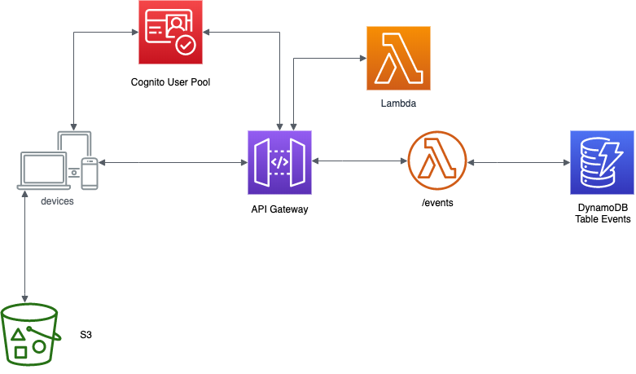
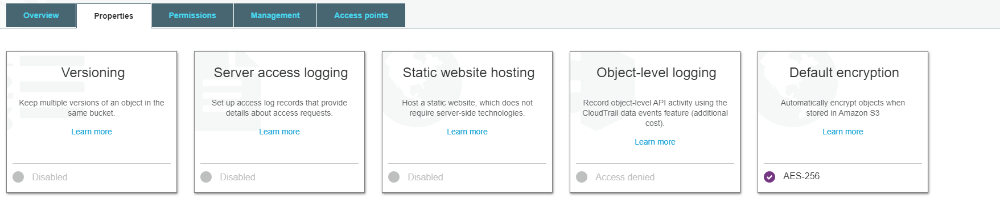
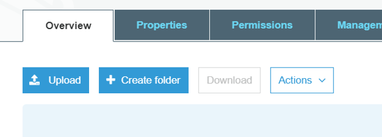
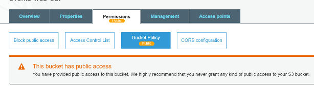

<p align="center">
    
</p>

# Laboratorio 8. Publicar la web en S3

<p align="center">
    
</p>

## Descargar y configurar la app

La app ya compilada se encuentra en https://github.com/josdev27/openathon-2020-serverless/tree/master/app. Teneis que descargaros el repositorio e ir a la carpeta app. Dentro ella está la carpeta assets/config. Dentro está el fichero con la configuración de la app, llamado config.json, que debemos editar informandonos con los valores que hemos ido obteniendo al configurar nuestros servicios.

```json
{
    "apiURL": "YOUR_API_URL",
    "apiKey": "YOUR_API_KEY",
    "cognitoRegion": "YOUR_COGNITO_REGION",
    "userPoolId": "YOUR_USER_POOL_ID",
    "userPoolWebClientId": "YOUR_USER_POOL_CLIENT_ID"
}
```

Para recuperar cada uno de estos valores, podemos consultar los servicios que hemos ido creando:

1. **apiUrl**: es la url de nuestra api deployada. Se puede obtener dentro de nuestra API, pulsando en stages y seleccionando el deplou que hayamos realizado ("prod" si seguimos las instrucciones).
2. **apiKey**: es la api key que hemos creado en nuestra API, podemos consultarla en API Gateway, en la sección *API Keys*, seleccionando la API Key creada en el laboratorio 6, y pulsando *show*.
3. **cognitoRegion**: dependerá de la región que hayamos utilizado para crear nuestros servicios. Podemos consultarlo desplegando en el menú la región (en el caso de Irlanda es *eu-west-1*.
4. **userPoolId**: podemos consultar en *General Settings* del user pool que hemos creado en Cognito.
5. **userPoolWebClientId**: es el *client id* de nuestra app en cognito. Para recuperarlo tenemos que acceder al User Pool que hemos creado en Cognito, seleccionar *App Clients* dentro de *General Settings* y allí consultarlo en el campo *App client id*

## Crear bucket en S3

En esta sección crearemos un bucket para almacenar nuestro front-end angular (website bucket):
1.	En la consola de AWS, en el menú Services buscaremos y seleccionaremos **S3**.
2.	Creamos el *web bucket* que contendrá el front-end. Pulsamos *Create Bucket*, como nombre y en minúsculas estableceremos 
*events-web-xxxx*. El nombre del bucket tiene que ser único en todo AWS, así que deberemos sustituir “xxxx” por un identificador exclusivo, por ejemplo “evento-web-john-smith1234”.
> Hay que verificar que te encuentras en la región correcta. Cada uno de los servicios que se creen en los laboratorios (Cognito, API Gateway, Lambda y DynamoDB) deben pertenecer a la misma región.
3.	Pulsamos *create*.
4.  Finalmente, encriptaremos el bucket. Para ello seleccionaremos el nuevo bucket creado. Sobre la pestaña properties, en la opción Default encryption seleccionaremos **AES-256**.
<p align="center">
    
</p>
Con ello ya tendremos creados los contenedores para nuestra aplicación.

## Subir web al bucket
Ahora publicaremos la aplicación angular Events-ui para que pueda ser consumida desde cualquier lugar del mundo.

Primero, vamos a subir la aplicación ya configurada al bucket que hemos creado:
1.	En la consola de AWS, en el menú Services buscaremos y seleccionaremos **S3**.
2.	Seleccionamos el bucket que creamos en un paso anterior para el almacenamiento y acceso de los recursos front de la aplicación (events-web-xxxx), “xxxx” es el nombre exclusivo que le asignamos cada uno de manera individual.

<p align="center">
    
</p>

3.	En la ventana resultado pulsamos *Upload*.
4.	Seleccionamos los ficheros que componen la aplicación angular (todos los descargados). El fichero *index.html* tiene que quedar situado en la raíz de bucket.
5.	Pulsamos *Upload*.

Ahora vamos a configurar los permisos del bucket, para hacer nuestra app accesible:

1.	Pulsamos la pestaña *Permissions* y accedemos a ella.
2.	Pulsamos en *Block public Access*.
3.	Pulsamos *edit* y deseleccionamos todas las opciones.
4.	Pulsamos *Save* y confirmamos en cualquier aviso que se muestre, escribiendo la palabra *confirm* en el diálogo.
5.	Pulsamos en *Bucket Policy*.
6.	Introduce la siguiente política, reemplazando el nombre del bucket (*events-web-xxxx*) por que corresponda:
```json
{
    "Version": "2012-10-17",
    "Statement": [
        {
            "Sid": "PublicReadGetObject",
            "Effect": "Allow",
            "Principal": "*",
            "Action": "s3:GetObject",
            "Resource": "arn:aws:s3:::events-web-xxxxxxxxxxxx/*"
        }
    ]
}
```
Nuestro bucket ahora aparecerá como de *Public Access*.

<p align="center">
    
</p>

7.	Pulsamos en la pestaña de propiedades.
8.	Pulsamos *Static website hosting*.
9.	Activamos el hosting web:
    * Seleccionamos *Use this bucket to host a website*.
    * En *Index document* introducimos: *index.html*.
    * Anotamos el Endpoint URL. Este será el punto de acceso a nuestra aplicación web.
10.	Pulsamos “save".

## Probar la aplicación :trophy: :fire:

Accedemos al endpoint previamente anotado desde un navegador web, y probamos cada una de las funcionalidades de la misma.

[< Lab 07](../lab-07)

<p align="center">
    
</p>
