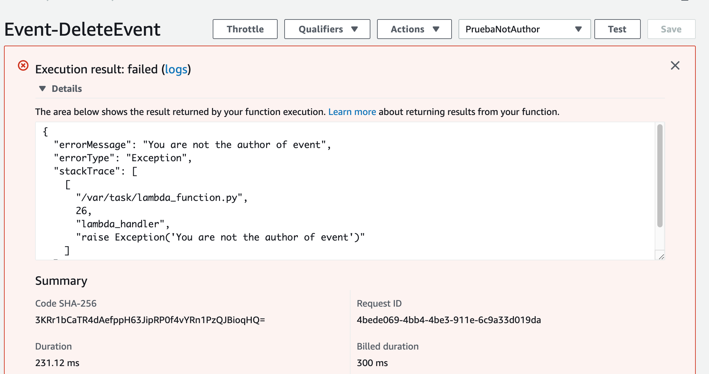

# DeleteEvent - Python Version

Primero tenemos que crear la función lambda, de la misma forma que en [lab-03](../lambda-functions-python/EventsList), pero el código fuente es el siguiente:

```python
# This lambda function is integrated with the following API methods:
# DELETE /events/{id}
#
# Its purpose is to delete a event in DynamoDB table

from __future__ import print_function
import boto3
import json
from boto3.dynamodb.conditions import Key
from botocore.exceptions import ClientError

def lambda_handler(event, context):

    print('Initiating DeleteEvents...')
    print("Received event from API Gateway: " + json.dumps(event, indent=2))

    dynamodb = boto3.resource('dynamodb')
    table = dynamodb.Table('events')

    try:
	    response_event = table.get_item(Key={'id': event["id"]})
	    item = response_event["Item"]
	    if item["addedBy"] == event["addedBy"]:
	        response = table.delete_item(Key={"id":event["id"]})
	    else:
	        raise Exception('You are not the author of event')
    except ClientError as e:
	    print(e.response['Error']['Message'])
	    print('Check your DynamoDB table...')
    else:
	    print("DeleteItem succeeded:")
	    print("Received response from DynamoDB: " + json.dumps(response, indent=2))
	    return
```

## Probar la función

Creamos un test de prueba cuya entrada es la siguiente:

```json
{
  "id": "939e0579-641e-4cd2-afe2-1384a2f0e816",
  "addedBy": "prueba@gmail.com"
}
```
donde,
* **id**: es un id de algún evento creado en la tabla de dynamodb.
* **addedBy**: es el correo del autor del evento.

Si el campo addedBy no se corresponde con el autor, se producirá una excepción con el mensaje 'You are not the author of event':

<p align="center">
    
</p>

[< Volver al Laboratorio 07 ](../../lab-07)
