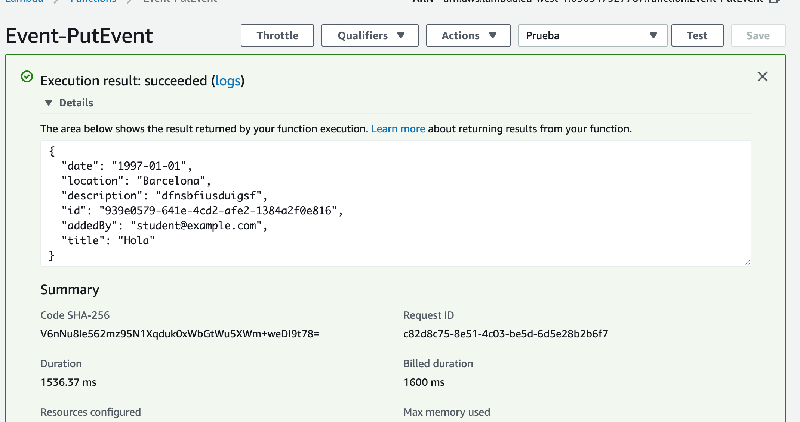

# Edit Event - Python Version

Primero tenemos que crear la funcion lambda, de la misma forma que en [lab-03](../lambda-functions-python/EventsList), pero el código fuente es el siguiente:

```python
# This lambda function is integrated with the following API methods:
# PUT /events/{id}
#
# Its purpose is to edit an event from our DynamoDB table

from __future__ import print_function
import boto3
import json
from boto3.dynamodb.conditions import Key
from botocore.exceptions import ClientError
import uuid

def lambda_handler(event, context):

    print('Initiating EditEvent...')
    print("Received event from API Gateway: " + json.dumps(event, indent=2))

    dynamodb = boto3.resource('dynamodb')
    table = dynamodb.Table('events')
    
    try:
    	response_event = table.get_item(Key={'id': event["id"]})
    	item = response_event["Item"]
    	item_put = event["body-json"]

    	if item["addedBy"] == event["addedBy"]:
    	    response = table.update_item(
    		Key={"id": event["id"]},
    		ExpressionAttributeNames={
    		    "#addedBy": "addedBy",
    		    "#date": "date",
    		    "#description": "description",
    		    "#title": "title",
    		    "#location": "location"
    		},
    		ExpressionAttributeValues= {
    		    ":addedBy":item_put["addedBy"],
    		    ":date":item_put["date"],
    		    ":description":item_put["description"],
    		    ":title":item_put["title"],
    		    ":location":item_put["location"]
    		},
    		UpdateExpression =  ("SET #addedBy = :addedBy,"  
    				    "#date = :date,"  
    				    "#description = :description," 
    				    "#title = :title," 
    				    "#location = :location")
    		)
    	else:
    	    raise Exception('You are not the author of event')
    except ClientError as e:
    	print(e.response['Error']['Message'])
    	print('Check your DynamoDB table...')
    else:
    	print("PutItem succeeded:")
    	print("Received response from DynamoDB: " + json.dumps(response, indent=2))
    	return item_put
```

## Probar la función

Creamos un test de prueba cuya entrada es la siguiente:

```json
{
  "date": "1997-01-01",
  "location": "Barcelona",
  "description": "dfnsbfiusduigsf",
  "id": "3a64b9fc-bac4-47cd-a591-1813f404475e",
  "addedBy": "prueba@gmail.com",
  "title": "Hola"
}
```
donde,
* **id**: id del evento a editar
* **addedBy**: es el correo del autor del evento.
* **date**: fecha de creación
* **location**: localización del evento
* **description**: descripción del evento 
* **title**:: titulo del evento.

Si el campo addedBy no se corresponde con el autor, se producirá una excepción con el mensaje 'You are not the author of event':

<p align="center">
    
</p>

Si la ejecución tiene éxito, nos devolverá el evento editado:

<p align="center">
    
</p>

[< Volver al Laboratorio 07 ](../../lab-07) 
