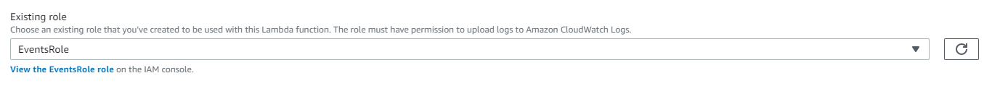

### Python version

1. Dejamos seleccionado “Author from Scatch” (crear desde cero) y en la sección Basic Information introducimos:
      * Function Name: Events-List.
      * Runtime: Python 3.8.
      * Pulsamos en “Choose or create an execution role” para expandirlo y marcamos “Use an existing role”, seleccionando el rol  “EventsRole”, que hemos creado previamente (en nuestra cuenta AWS) o que ya existe (si usamos la cuenta de formación). En ambos casos podemos navegar a ver los detalles del rol, y podemos comprobar que tiene asignadas dos políticas de seguridad que determinan lo que la función puede hacer, en este caso utilizar el servicio de logs (para la escritura de trazas de ejecución) y el servicio DynamoDB, para acceder a la tabla "events" que hemos creado previamente.
<p align="center">
    
</p>  
2. Pulsamos “Create Function”. Nuestra función será añadida, aún sin implementación, a la lista de disponibles y se abrirá una ventana de detalle.
<p align="center">
    
</p>  
3. Con la función creada, en la ventana de detalle de la función vamos a incorporar su implementación. Para ello nos desplazamos a la parte inferior de la ventana donde se puede editar su código. Allí reemplazamos el contenido por:

    ```python
    # Events-List
    # Esta función lambda se integra con el siguiente API method:
    # /events GET (list operation)
    # Su proposito es obtener los eventos existentes en la table Events

    from __future__ import print_function
    import boto3
    import json
    from boto3.dynamodb.conditions import Key
    from botocore.exceptions import ClientError

    def lambda_handler(event, context):

        print('Initiating Events-List...')
        print("Received event from API Gateway: " + json.dumps(event, indent=2))
        
        # Creamos el acceso a la tabla DynamoDB por el nombre
        dynamodb = boto3.resource('dynamodb')
        table = dynamodb.Table('events')

        # Obtenemos todos los eventos existentes en la tabla
        try:
            response = table.scan()
        except ClientError as e:
            print(e.response['Error']['Message'])
        else:
            print("scan succeeded:")

            # De la respuesta obtenida de DynamoDB devolvemos los items
            return response["Items"]
    ```

4.	Pulsamos “Save”.


[< Volver al Laboratorio 03 ](../../lab-03)  
