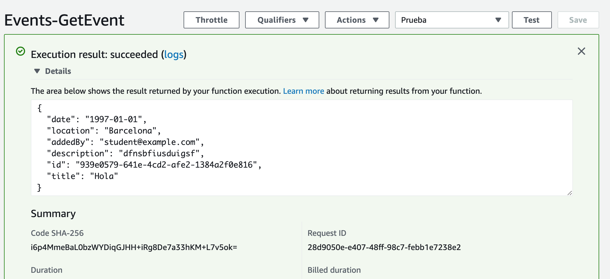

# Get Event by id - Python Version

Primero tenemos que crear la funcion lambda, de la misma forma que en [lab-03](../lambda-functions-python/EventsList), pero el código fuente es el siguiente (:warning: recuerda sustituir el nombre de la tabla por el tuyo):

```python
# This lambda function is integrated with the following API methods:
# GET /events/{id}
#
# Its purpose is to get an event from our DynamoDB table

from __future__ import print_function
import boto3
import json
from boto3.dynamodb.conditions import Key
from botocore.exceptions import ClientError

def lambda_handler(event, context):

    print('Initiating GetEventId...')
    print("Received event from API Gateway: " + json.dumps(event, indent=2))

    dynamodb = boto3.resource('dynamodb')
    table = dynamodb.Table('events_XXXX')

    try:
	response_event = table.get_item(Key={'id': event["id"]})
	item = response_event["Item"]
    except ClientError as e:
	print(e.response['Error']['Message'])
	print('Check your DynamoDB table...')
    else:
	print("GetItem succeeded:")
	print("Received response from DynamoDB: " + json.dumps(response_event, indent=2))
	# Return only the Items and not the whole response from DynamoDB
	return item
```

## Probar la función

Creamos un test de prueba cuya entrada es la siguiente:

```json
{
  "id": "939e0579-641e-4cd2-afe2-1384a2f0e816"
}
```
donde,
* **id**: es un id de algún evento creado en la tabla de dynamodb.

Si se ejecuta correctamente, nos devolverá el evento:

<p align="center">
    
</p>

[< Volver al Laboratorio 06 ](../../lab-06) 
